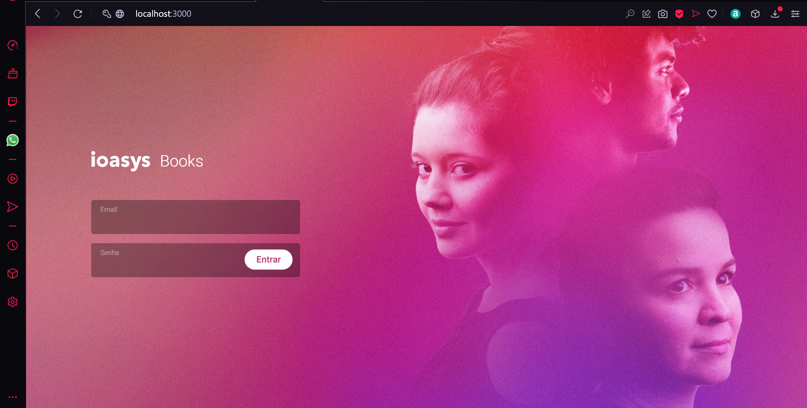
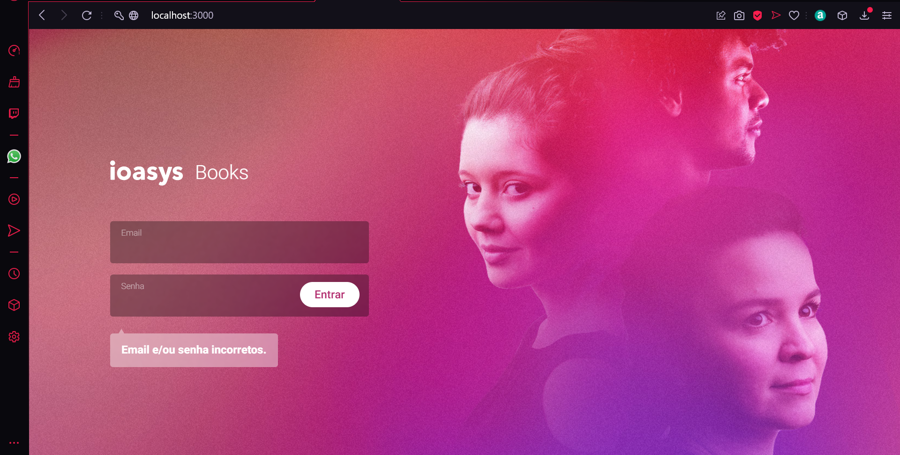
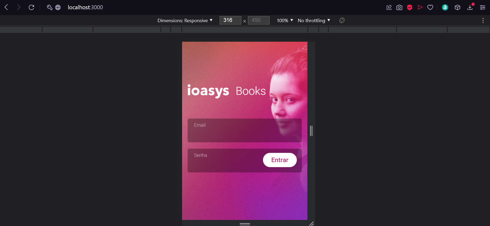
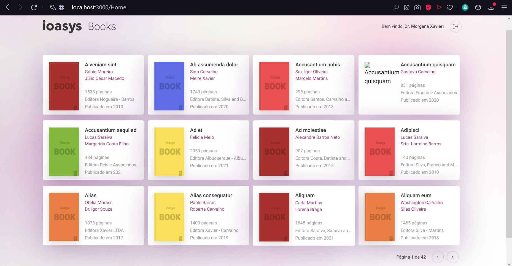
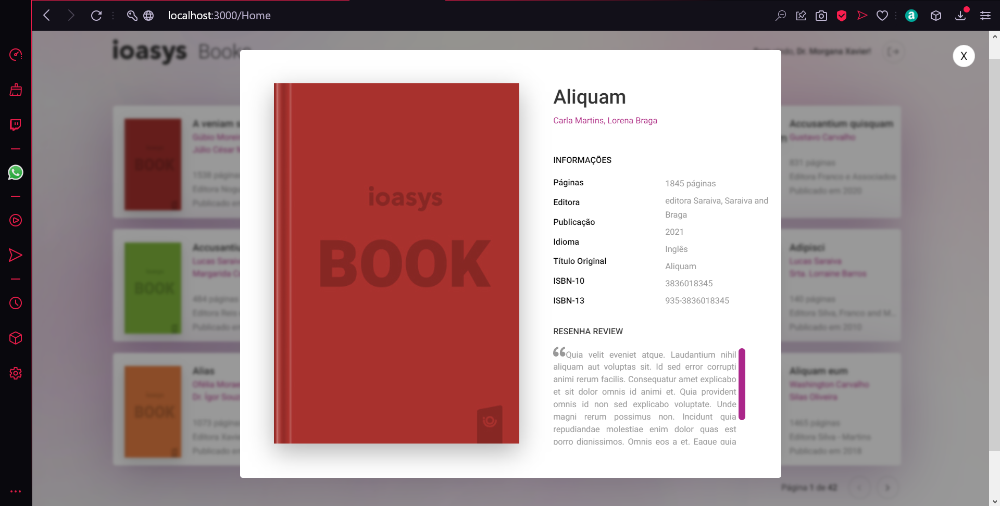
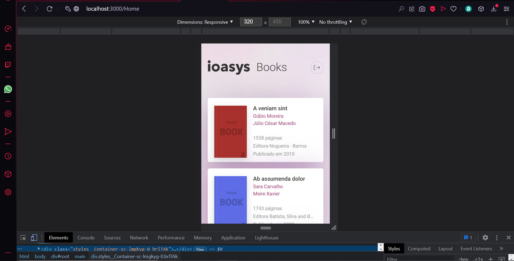
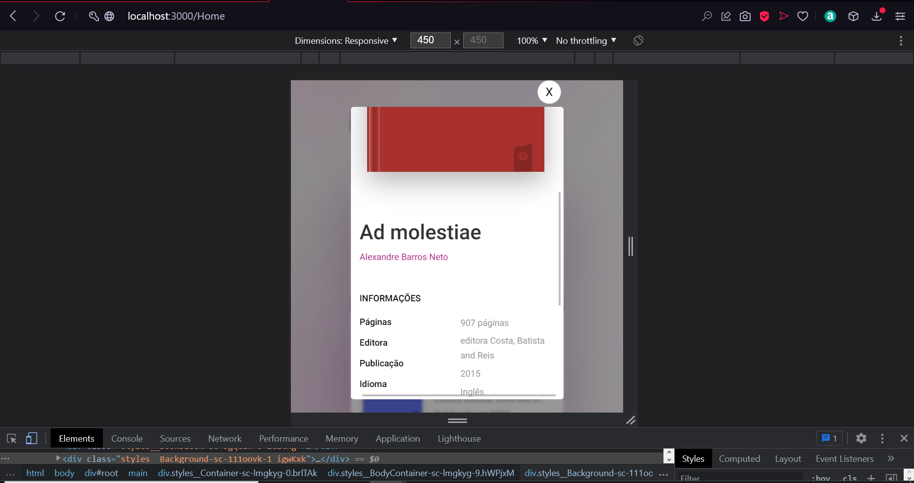

# Ioasys Books
## Iniciar  Projeto
`npm start`
## Bibliotecas utilizadas
<ul>
  <li>ReactJS utilizando Hooks como useState, useEffect...</li>
  <li>React Router DOM</li>
  <li>Styled Components</li>
  <li>API RESTFull com AXIOS para manipulação dos dados </li>
  <li>Async / Await para chamadas as API's do projeto</li>
</ul>

## Telas
### Login

### Home

